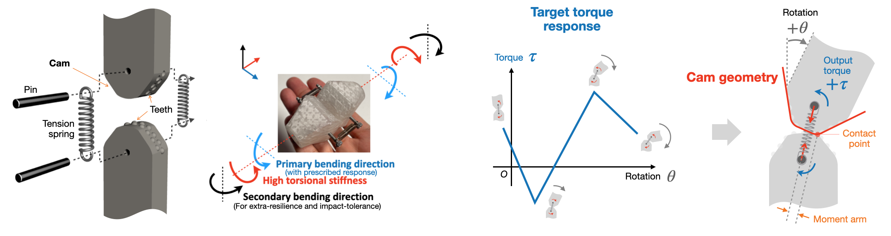
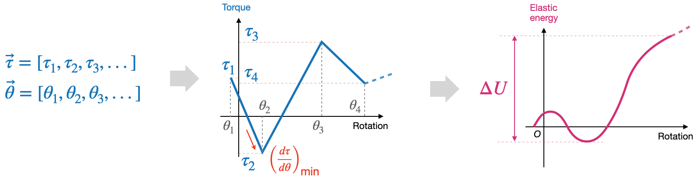
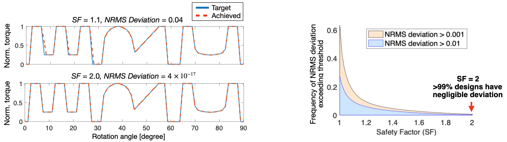

# Elastic Rolling Cam (ERC) Design Repository

This repository contains two alternative ERC design workflows:

- the original MATLAB implementation in [`matlab/`](matlab),
- the Python port in [`erc_design/`](erc_design), extended for simulation and Isaac Lab integration.

They implement the same ERC design idea, but they target different use cases. The MATLAB side remains the original lab workflow for design and manufacturing. The Python side is the integration-oriented workflow for optimization loops, repair, export, and downstream simulation wrappers.

The ERC concept and design methodology are described in:

> Wu, Rui, Luca Girardi, and Stefano Mintchev. "Encoding mechanical intelligence using ultraprogrammable joints." *Science Advances* 11.17 (2025): eadv2052.



## Repository Layout

```text
.
├── matlab/                     original MATLAB workflow and sensorized utilities
│   ├── Step1_SpringSelector.m
│   ├── Step2_ERCdesigner.m
│   ├── Step3_ERCmodeller.m
│   ├── repair_support_function.m
│   ├── ERC_model.mlx
│   ├── ERC_model.md
│   ├── ERC_demo.m
│   ├── arduino/ERC_sensorised.ino
│   └── README.md
├── erc_design/                 torch-native Python ERC implementation
├── examples/                   Python examples and Isaac Lab entrypoints
├── configs/                    spring catalog and example configs
├── results/                    Python-generated outputs
├── img/                        figures used in the documentation
├── ISAAC_LAB_INTEGRATION.md    Python integration notes
└── CITATION.cff
```

## Choosing A Workflow

Use the MATLAB workflow if you want:

- the original end-to-end design process as developed in the lab,
- the live-script formulation and script-based manufacturing flow,
- the sensorized ERC scripts and Arduino demo.

Use the Python workflow if you want:

- a programmable API instead of an interactive script flow,
- repaired support functions and exportable simulator-facing torque tables,
- function-defined or point-wise ERC profiles for Isaac Lab integration,
- wrappers around downstream simulation repositories.

The two workflows are alternatives. You do not need the Python package to run the MATLAB scripts, and you do not need MATLAB to use the Python API.

## Python Workflow

The Python package reproduces the support-function ERC formulation from the MATLAB workflow and exposes it as reusable classes and helpers:

- `Spring` and `SpringCatalog` load spring definitions from [`configs/springs.yaml`](configs/springs.yaml).
- `PiecewiseLinearTorqueProfile` stores target torque knots.
- `ERCDesigner` converts a target torque profile into a realizable cam profile.
- `ERCDesignResult` stores repaired and unrepaired radii, curvature, cam geometry, and the final output torque table.
- `build_erc_design()` and `build_erc_torque_table()` are simple simulator-facing entry points.
- `build_erc_design_from_function()` and `build_erc_torque_table_from_function()` accept analytic torque functions, negate them internally into ERC sign convention, and export Isaac-facing repaired outputs.

The generated output torque table always has columns:

```text
[joint_angle_rad, torque_nm]
```

### Python Quick Start

Minimal dependencies:

- `torch`
- `PyYAML`

The interactive example also uses:

- `matplotlib`
- `tkinter`

Example setup:

```bash
python -m venv .venv
source .venv/bin/activate
pip install torch pyyaml matplotlib
```

Minimal usage:

```python
import math

from erc_design import ERCDesignConfig, ERCDesigner, PiecewiseLinearTorqueProfile, SpringCatalog

spring = SpringCatalog.from_yaml("configs/springs.yaml")["durovis_0.9x6.1x21"]
profile = PiecewiseLinearTorqueProfile.from_xy(
    [-math.pi / 2.0, 0.0, math.pi / 2.0],
    [0.25, 0.0, -0.25],
)

designer = ERCDesigner(
    spring,
    ERCDesignConfig(
        angle_convention="joint",
        joint_angle_limits_rad=(-math.pi / 2.0, math.pi / 2.0),
    ),
)
result = designer.design(profile, repair=True)
```

Higher-level helper:

```python
from erc_design import build_erc_torque_table

table = build_erc_torque_table(
    [
        (-0.25, -0.25),
        (0.10, 0.10),
        (30.0, 0.0),
        (76.0, 0.0),
        (78.0, 0.2),
    ],
    spring_id="durovis_0.9x6.1x21",
)
```

### Torque Sign Convention

There are two sign conventions in play:

- Isaac Lab / simulator-facing convention: a restoring torque has negative slope around a stable equilibrium.
- Internal ERC design convention: the support-function workflow uses the opposite torque sign.

For this reason, function-defined profiles intended for simulation are negated before entering the ERC designer, and the repaired output is then exported back in the Isaac-facing convention.

Practical rule:

- define the torque law with the physically intuitive Isaac Lab sign,
- do not manually negate it before calling the function-based helpers.

### Python Examples

Interactive editor:

```bash
python3 examples/erc_test.py
```

This GUI lets you:

- edit the requested torque-profile table,
- drag torque knots directly on the plot,
- inspect repaired vs. unrepaired cam geometry,
- export `.sldcrv` and `.xyz` curves.

Function-defined bistable Isaac wrapper:

```bash
python3 examples/erc_bistable_isaaclab_example.py --headless
```

This example:

- builds a bistable function-defined ERC profile,
- runs ERC scaling and convexity repair,
- writes repaired torque tables and CAD-oriented cam exports,
- generates a local config for [`erc_isaac/joint_response.py`](erc_isaac/joint_response.py),
- calls [`scripts/convert_concentrated_urdf_yaw_only.py`](scripts/convert_concentrated_urdf_yaw_only.py) if the yaw-only USD is missing,
- recolors the resulting asset so non-folding arms, folding arms, and motors are easier to distinguish,
- keeps generated videos and analytics outputs under this repository's `results/` tree,
- exposes `--headless`, `--video`, `--analytics`, `--analytics_path`, and `--analytics_fps`,
- uses the same playback slow-down for analytics replay as for viewport video, matching the Morphy example behavior.

Point-wise repaired-profile wrapper:

```bash
python3 examples/erc_profile_morphy_example.py --headless
```

This is now a fully local Morphy example derived from the repaired point-wise
profile workflow previously used downstream. It exposes the same main runtime
options locally:

- `--video`
- `--analytics`
- `--analytics_path`
- `--analytics_fps`
- `--camera_eye`
- `--camera_target`
- `--results_dir`

All generated outputs stay in this repository by default under
`results/morphy_erc_profile_example/`, including the generated Morphy USD
workspace, PDF reports, cam exports, CSV logs, viewport video, and analytics
video.

More Python integration details are documented in [`ISAAC_LAB_INTEGRATION.md`](ISAAC_LAB_INTEGRATION.md).

## MATLAB Workflow

The original MATLAB implementation is now isolated under [`matlab/`](matlab). Start with [`matlab/README.md`](matlab/README.md).

The core steps are:

1. [`matlab/Step1_SpringSelector.m`](matlab/Step1_SpringSelector.m): derive spring requirements from a target torque profile.
2. [`matlab/Step2_ERCdesigner.m`](matlab/Step2_ERCdesigner.m): synthesize the support function and evaluate the torque response.
3. [`matlab/Step3_ERCmodeller.m`](matlab/Step3_ERCmodeller.m): generate export data and AutoCAD scripts for printable geometry.

The MATLAB subtree also contains:

- [`matlab/repair_support_function.m`](matlab/repair_support_function.m)
- [`matlab/ERC_model.mlx`](matlab/ERC_model.mlx)
- [`matlab/ERC_model.md`](matlab/ERC_model.md)
- [`matlab/ERC_demo.m`](matlab/ERC_demo.m)
- [`matlab/arduino/ERC_sensorised.ino`](matlab/arduino/ERC_sensorised.ino)
- the sensorized modelling scripts and supporting live scripts

The intended usage is to run the MATLAB scripts from the `matlab/` directory so their outputs stay isolated under `matlab/results/`.

## Repair Function

Both workflows include a repair stage for inadmissible support functions. The repair step:

- checks the convexity radius `r + r''`,
- modifies the support function when needed,
- returns repaired torque and cam geometry,
- records whether scaling and/or repair were applied.

Relevant Python outputs in `ERCDesignResult` include:

- `was_scaled`
- `was_repaired`
- `support_radius_m`
- `repaired_support_radius_m`
- `curvature_radius_m`
- `repaired_curvature_radius_m`
- `cam_xy_m`
- `repaired_cam_xy_m`

## Spring Catalog

[`configs/springs.yaml`](configs/springs.yaml) now includes the original entries together with additional springs used during the downstream Python and Isaac integration work.

## Original Design Background

The Elastic Rolling Cam is a rotational joint made of two rolling, spring-loaded cams. By designing the cam geometry appropriately, the joint can approximate a prescribed nonlinear stiffness or torque-angle relationship.



The original design method chooses spring parameters so the spring can realize both:

- the required maximum torque reduction rate,
- the required elastic-energy variation.

Choosing a larger safety factor improves matching accuracy at the cost of larger joint size.



## Contributors

- Rui Wu ([@wurui1991](https://github.com/wurui1991)): original ERC repository and MATLAB workflow.
- Luca Girardi ([@lucagirardi](https://github.com/lucagirardi)): Python port, repair-oriented updates, Isaac integration, and documentation updates.
- Gabriel Maquignaz ([@gabmaquignaz](https://github.com/gabmaquignaz)): MATLAB, repair-oriented, and integration-related updates.
- Etor Arza Gonzalez ([@EtorArza](https://github.com/EtorArza)): downstream simulation and airframe-integration contributions.

## Citation

If you use the repository, the ERC formulation, or derived content in academic work, please cite:

```text
Wu, Rui, Luca Girardi, and Stefano Mintchev.
"Encoding mechanical intelligence using ultraprogrammable joints."
Science Advances 11.17 (2025): eadv2052.
```

A machine-readable citation is provided in [`CITATION.cff`](CITATION.cff).

## License

This repository is released under the MIT License with the copyright notice attributed to Environmental Robotics Lab in [`LICENSE`](LICENSE).

## Acknowledgment

This work is funded by the European Union's Horizon Europe research and innovation programme under the project SPEAR (Grant No. 101119774), the Swiss National Science Foundation (SNSF) under the Eccellenza Grant (Grant No. 186865), and the ETH Zurich Research Grants (Grant No. ETH-15 20-2).
